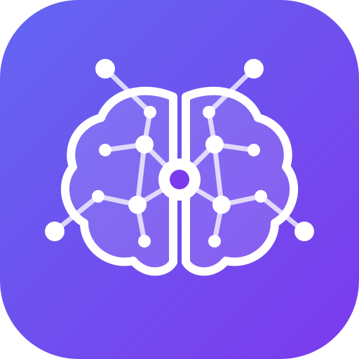

<p align="center"></p>

<h1 align="center">ai-core-memory</h1>

**An open, self-hosted, cross-platform memory system for AI assistants.**

Every AI chat, code session, and project you work in learns something — and then forgets
it the moment the session ends. Move to a different chat, a different repo, or a
different tool, and you're back to re-explaining context you already established
somewhere else. Today the only bridge between sessions is manual copy-paste.

Some vendors are building memory into their own assistants, but so far it's tied to a
specific product, plan, or account tier. **ai-core-memory** is an attempt to define the
same idea — durable, cross-session memory — as an open format and process that works
with any AI platform that supports [Skills](https://www.anthropic.com/news/skills) and
[MCP](https://modelcontextprotocol.io/) interoperability, starting with Claude.

## The idea: dream mode

Human memory doesn't work session-by-session either. Short-term experience accumulates
all day, and it's sleep — specifically dreaming — that consolidates the useful parts into
long-term memory: pruning noise, reinforcing what recurred, and reconciling it with what
you already knew.

`ai-core-memory` copies that shape:

- **Short-term** — day-to-day chats, code sessions, and project work generate raw
  "residue": decisions made, corrections given, facts learned, dead ends hit.
- **Dream cycle** — a periodic or on-demand consolidation pass (see
  [`.claude/skills/dream/`](.claude/skills/dream/SKILL.md)) reviews that residue,
  classifies it, merges it with existing long-term memory, and discards the noise.
- **Long-term** — the result is a small set of durable, human-readable records:
  instructions, intents, and facts — the things worth carrying into every future
  session, in every context that's allowed to see them.

## Design principles

1. **Open storage, not a database.** Memory is plain Markdown with YAML frontmatter —
   readable, diffable, greppable, and portable to any tool that can read a file.
2. **Partitioned by default.** Memory belongs to a **scope** — session, project, team,
   or user — and scopes don't leak into each other automatically. Context matters, but
   so does shared experience; see [docs/ARCHITECTURE.md](docs/ARCHITECTURE.md) for the
   partition model.
3. **Promotion, not inheritance.** A fact learned in one project only becomes team- or
   user-level memory when the dream cycle deliberately promotes it — never silently.
4. **Platform-agnostic delivery.** The same records should be usable by anything that
   speaks Skills, MCP, or just reads instruction files (`CLAUDE.md`, `AGENTS.md`, etc.).
   No lock-in to a single vendor's memory feature.

## Repo layout

```text
.claude/skills/dream/   the dream-cycle consolidation skill (Claude Skills format)
docs/ARCHITECTURE.md    full design: scopes, memory record schema, the dream pipeline
docs/DEPLOYMENT.md      running the memory hub: Docker/Podman/k3s/k8s
docs/DISTRIBUTION.md    getting skills + the hub into Claude Code and Claude.ai
docs/SECURITY.md        API token hardening, visibility/roles, local + OIDC auth
memory/schema/          canonical templates for each memory type
memory/README.md        where runtime memory data lives and what is/isn't committed
CLAUDE.md               AI working instructions for this repo
AGENTS.md               pointer to CLAUDE.md for non-Claude coding assistants
```

## Status

Working, self-hostable, not yet battle-tested. The memory model and the `dream` skill work with plain files
alone. The **memory hub** in [`hub/`](hub/README.md) — Python, FastAPI, SQLite, MCP, web UI (light/dark) and the
offline `acm` CLI — covers accounts with OIDC SSO and per-user API tokens, teams and project visibility,
consolidation (reinforcement, supersession, decay, a human-approved proposal queue), plugins (Obsidian and
Memos in; Slack/Teams/ntfy/webhook out), a Claude Code plugin, `acm compile` for tools that only read an
instruction file, and k3s/k8s manifests. Not yet verified: the container image build and a live Claude Code
session using the plugin's skills. See [docs/ARCHITECTURE.md](docs/ARCHITECTURE.md#roadmap) for what is and
isn't done.

## Getting started (Claude Code / Claude.ai today)

1. Clone this repo (or copy `.claude/skills/dream/` and `memory/schema/` into your own).
2. Work normally — chat, code, make decisions.
3. When you want to consolidate what happened, ask Claude to run the `dream` skill (or
   just say "dream on this" / "commit this to long-term memory"). It will read
   `memory/schema/` for the record format, write or update files under `memory/data/`,
   and update the index.
4. Future sessions — in this repo, in this tool or another that reads the same files —
   pick the memory back up instead of starting cold.

## Contributing

This is early and opinionated by design — see [docs/ARCHITECTURE.md](docs/ARCHITECTURE.md)
before proposing changes to the scope model or record schema, since those are the parts
everything else depends on. Issues and PRs welcome.

## License

[MIT](LICENSE)
